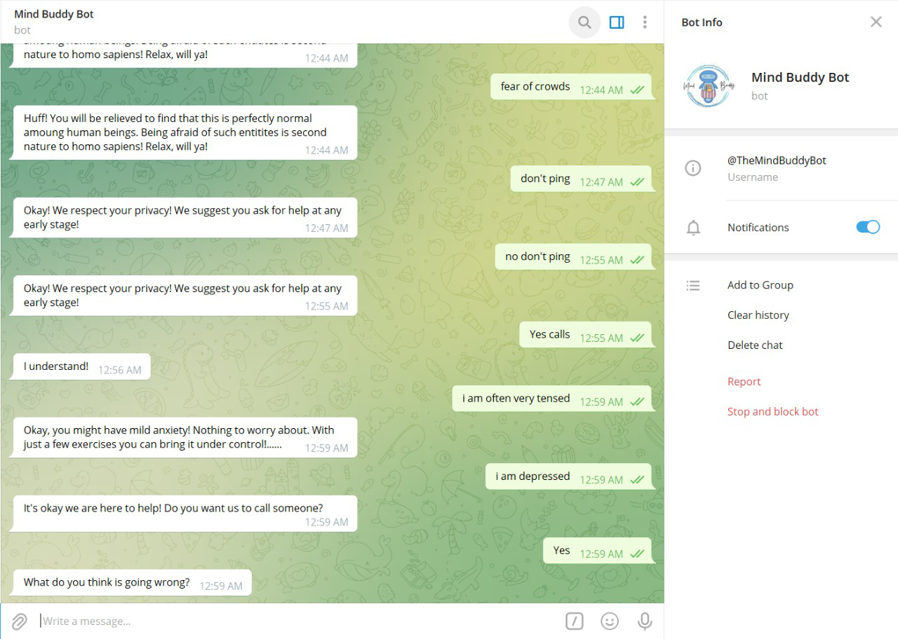
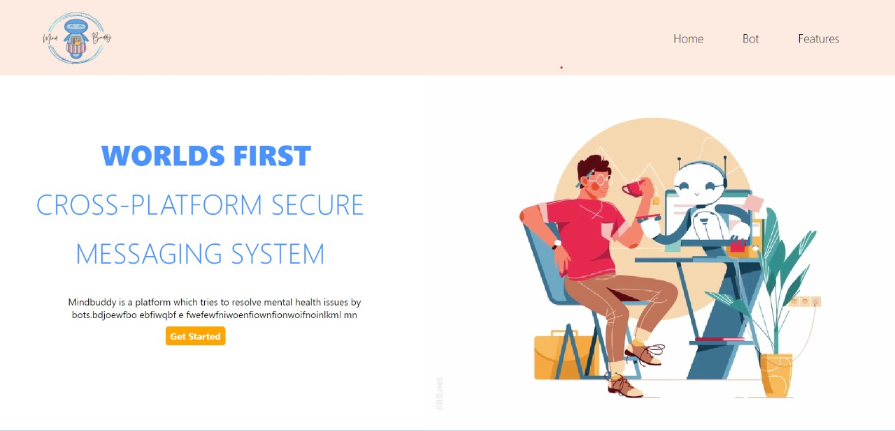

# The-Mind-Buddy
Eversince the pandemic, mental health became a primary issue of concern as mankind suffered 
from various grievances caused not only due to losses of near and dear ones but also due to 
the feeling of being trapped alone, leading to depression, anxiety, stress, frustration,etc.

We, here at Mind Buddy, heard those cries of help and decided to come up with a friend, whom 
one can count on 24/7 for 365 days! 

MIND BUDDY [bot](https://t.me/TheMindBuddyBot), a personal chatbot made for telegram users around the world, that is always be there to listen to you, 
even in your darkest hour !!

https://mindbuddy.netlify.app/

  ## Supported tests:

 - [Hamilton Anxiety Rating Scale](https://en.wikipedia.org/wiki/Hamilton_Anxiety_Rating_Scale)
 - [Montgomery–Åsberg Depression Rating Scale](https://en.wikipedia.org/wiki/Montgomery%E2%80%93%C3%85sberg_Depression_Rating_Scale)
 
- Special Inclusion - Real-Time Help
  
  ## Features
    > Mind Buddy Helps one with their mental health management.                         
               When one just feels low or has a mood crash,                                   
               Mind-Buddy  will suggest ideas to engage them, learn and get                   
               motivated for different types of activities.
    
    > When one has severe mental issues, unhealed traumas that                                                                                                                          makes one feel burnt out, Mind buddy consults psychologist appointments with or                                                                                             without parental concern so that one can heal quickly.   
    
    >  If the patient feels suicidal or self harming,                                 
               mind-buddy will inform police and update nearby people                         
               who are close to the user in order to prevent the mishap. 
    
  ## Screenshots

